## 目录

# 1. 部署说明

Hera operator的作⽤是在k8s集群中的指定namespace下⼀键拉起⼀个hera平台。该⽂档适⽤于有⼀定k8s基础(PV、PVC、Service、Pod、Deployment、DaemonSet等)的研发/运维同学。

Hera是⼀套企业级的可观测性平台，部署时复杂度⾮常⾼，部署前请认真阅读以下部署⽂档及相关的[operator介绍视频](https://mp.weixin.qq.com/s?__biz=MzkwMjQzMzMxMg%3D%3D\&mid=2247483720\&idx=1\&sn=c38fca2d3e82de43ce22acad73a1be21\&chksm=c0a4de07f7d35711c5cba634c3833708db19fcc9303a50b77f8c1601831cac8e9520e3f32ff5\&token=1000658198\&lang=zh_CN\&rd "operator介绍视频")。

# 2. 部署步骤

hera-all/hera-operator/hera-operator-server/src/main/resources/operator/

## 2.1 k8s资源申请

虽然operator拉起来的Hera平台并不是⽣产环境下的配置，但是也需要满⾜request最低的配置要求， 否则其中的组件可能因为资源不够导致启动失败。

request要求：

-   内存：6250Mi ;
-   CPU：3252m

实际运⾏⼀天后的资源使⽤：

-   内存：16Gi
-   CPU：562m

## 2.2 创建独⽴命名空间及账号

执⾏命令，⽣效auth yaml（默认会⽣成空间：hera-namespace，账号：admin-mone）

```shell
kubectl apply -f hera_operator_auth.yaml
```

## 2.3创建 hera CRD

执⾏命令，⽣效crd yaml

```shell
kubectl apply -f hera_operator_crd.yaml
```

## 2.4 部署 operator

### 2.4.1 执⾏命令，部署 operator

```shell
kubectl apply -f hera_operator_deployment.yaml
```

确保部署的operator⼯程端⼝7001，能够对外访问。hera部署需要在operator提供的对外⻚⾯上进⾏操作。默认例⼦中使⽤LoadBalancer⽅式对外暴露可访问的ip、port。如需使⽤其它⽅式请⾃⾏修改yaml。

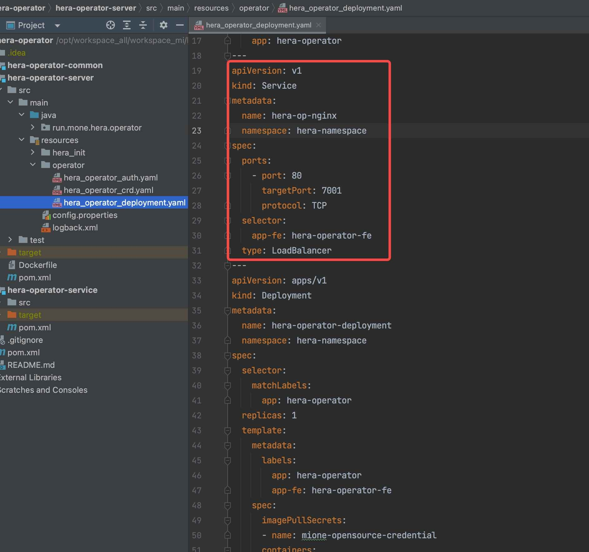

## 2.5 Operator⻚⾯操作

### 2.5.1访问operator⻚⾯

如果是使⽤2.3步中LoadBalancer⽅式，请先找到"hera-op-nginx" service的对外ip。执⾏命令：

```shell
 kubectl get service -n=hera-namespace
```

找到 hera-op-nginx 对应的EXTERNAL-IP

默认访问地址：http\://EXTERNAL-IP:80/，可⻅如下界⾯：

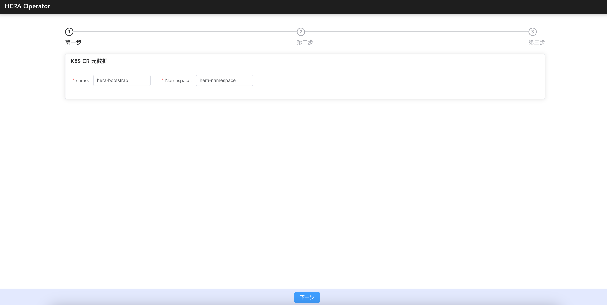

### 2.5.2 operator元数据填写

-   name：hera-bootstrap

k8s⾃定义资源名称，保持默认值不变

-   Namespace：hera-namespace

hera部署的独⽴空间，建议保持 hera-namespace 不变，如需改变请注意yaml全局变更

### 2.5.3 k8s访问⽅式确认

该步骤是⽣成hera平台中需要对外开放⻚⾯的访问ip:port。当前只⽀持k8s的*LoadBalancer、NodePort⽅式。默认会先尝试LB模式，如若不⽀持，则选择NodePort（如果NodePort的ip未开放对 外访问，则需另起代理，建议集群开启LB）。*

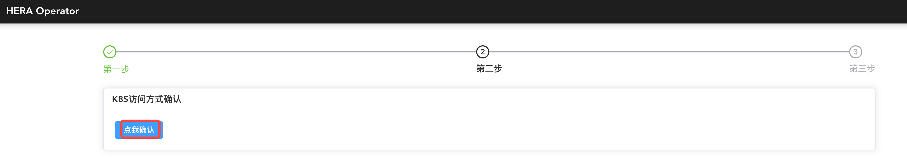

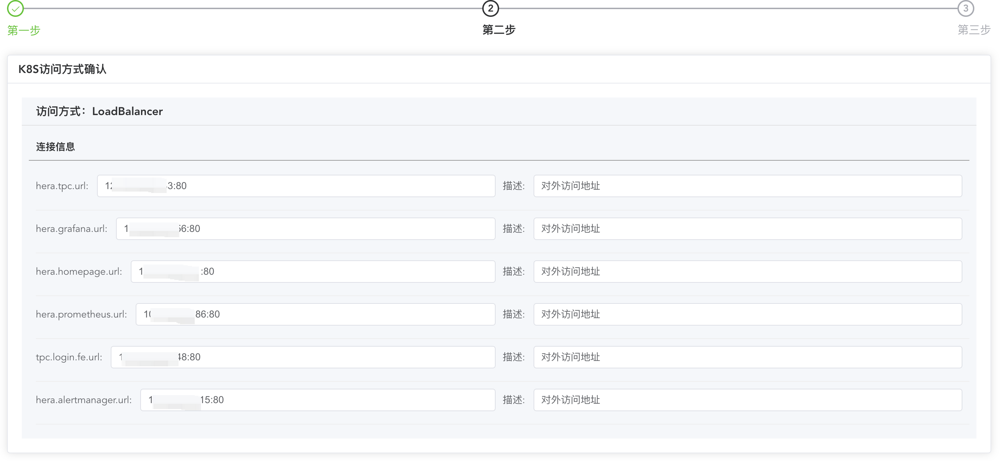

请记住hera.homepage.url，hera集群搭建完后，默认访问地址就是：http\://\${hera.homepage.url}

### 2.5.4 集群配置

#### k8s-serviceType请勿修改

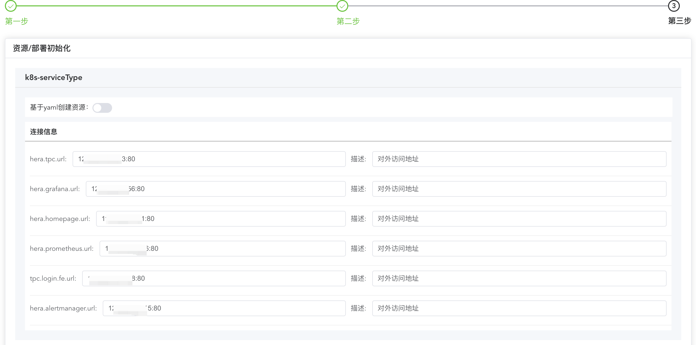

#### Hera-mysql

⽬的是选择⼀个hera可⽤的mysql数据库。

如果需要k8s⾃动搭建⼀个数据库

则开启"基于yaml创建资源"按钮，默认的yaml会创建⼀个pv进⾏mysql的数据存储，如果沿⽤默认的yaml，⼀定要注意：

1.  提前在宿主机node上创建⽬录/opt/hera_pv/hera_mysql（可更换⽬录，同步修改此处yaml）；
2.  找到创建⽬录的node名（可以执⾏ kubectl get node进⾏确认），替换此处的cn-bxxx52；
3.  连接信息确保与yaml中信息⼀致，默认⽆需修改；

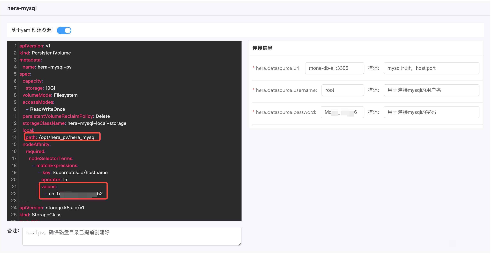

如果已有数据库，⽆需k8s创建，则：

1.  关闭"基于yaml创建资源"按钮；
2.  填写正确的已有数据库url、⽤⼾名、密码；
3.  默认operator执⾏时会⾃动去改数据库进⾏创建hera数据库及表；

如果填写的账号⽆建库、建表权限，则需提前⼿动去⽬标库中建好hera数据库和表，建表语句在operator源码hera-all/hera-operator/hera- operator-server/src/main/resources/hera\_init/mysql/sql ⽬录下

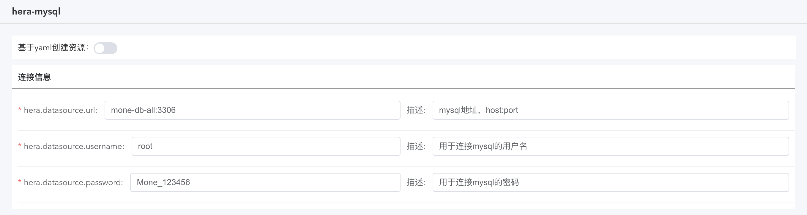

#### Hera-redis

⽬的是选择⼀个hera可⽤的Redis

如果需要k8s⾃动搭建⼀个Redis

则需要开启“基于yaml创建资源”按钮。使⽤默认yaml创建的redis没有密码，如果需要设置密  码，则需要修改右侧hera.redis.password的值，与redis设置的密码保持⼀致

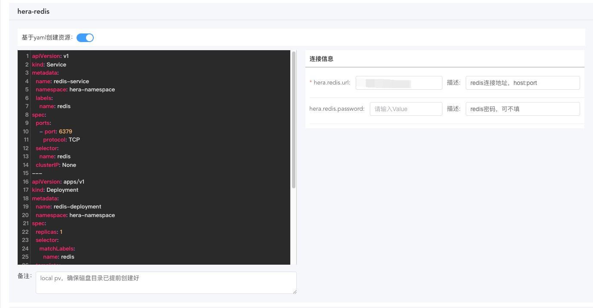

如果已有Redis，⽆需k8s搭建

1.  关闭"基于yaml创建资源"按钮；
2.  填写正确的已有Redis集群的URL、密码

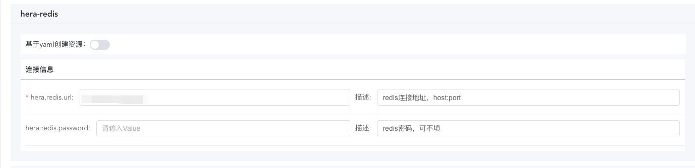

#### Hera-es

⽬的是选择⼀个Hera可⽤的ES集群，并在ES中创建Hera所需要的索引模板。

如果需要k8s⾃动搭建⼀个ES则需要开启“基于yaml创建资源”按钮。使⽤默认yaml创建的ES没有账号密码，如果需要设置账   号密码，则需要：

1.  修改左侧yaml中的 xpack.security.enabled 为true
2.  修改右侧“连接信息”中的hera.es.username与hera.es.password的值，⼀般地，我们都会⽤elastic的账号，密码需要在ES服务启动后进⾏设置
3.  在ES启动后，登⼊ES所在pod中，进⼊/usr/share/elasticsearch/bin⽬录执⾏elasticsearch- setup-passwords interactive命令，设置ES默认账号的密码，注意，这⾥设置的密码，需要与⻚⾯hera.es.password的值保持⼀致


如果已有ES，⽆需k8s创建，则：

1.  关闭"基于yaml创建资源"按钮；
2.  填写正确的已有ES集群的url、账号、密码
3.  默认operator执⾏时会⾃动创建索引模版。如果填写的账号⽆创建索引模版的权限，则需   要提前⼿动创建Hera所需要的索引模版。Hera的索引模版在operator源码run.mone.hera.operator.common.ESIndexConst中，以json的格式存储。
4.  如果ES集群可以通过api访问，可以通过执⾏run.mone.hera.operator.common.ESIndexConst中的main⽅法，获取创建索引模版的curl请求。

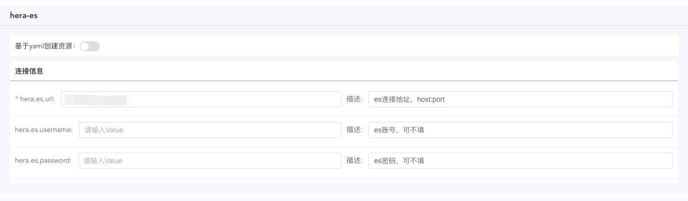

#### hera-rocketMQ

⽬的是选择⼀个hera可⽤的RocketMQ

如果需要k8s⾃动搭建⼀个RocketMQ

1.  需要开启“基于yaml创建资源”按钮。
2.  使⽤默认yaml创建的RocketMQ没有accessKey\secretKey，如果需要设置accessKey\secretKey，则需要修改右侧“连接信息”中的hera.rocketmq.ak与hera.rocketmq.sk的值。
3.  如果需要更换RocketMQ broker的service，需要同时替换yaml中的service，以及hera- operator代码中的run.mone.hera.operator.service.RocketMQSerivce类的成员变量"brokerAddr"的值。

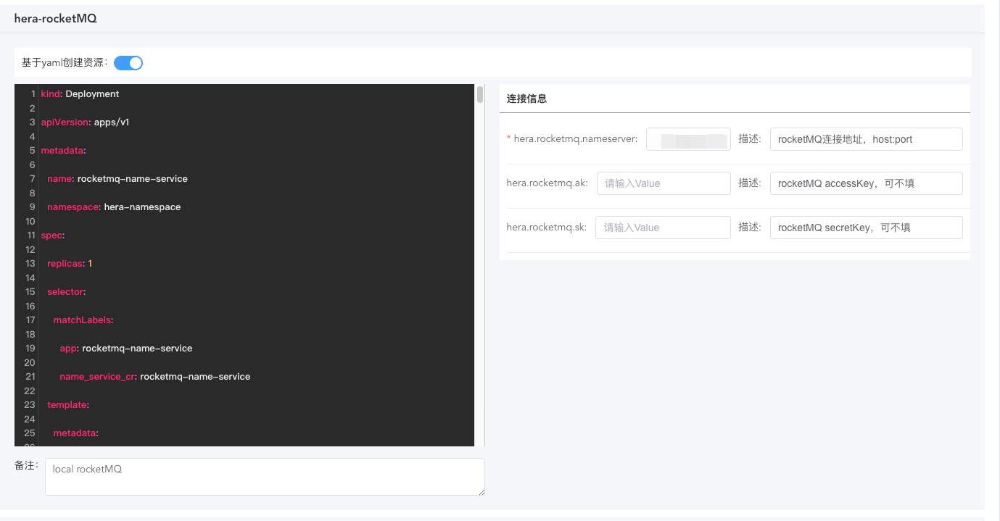

如果已有RocketMQ，⽆需k8s搭建，则：

1.  关闭"基于yaml创建资源"按钮；
2.  填写正确的已有RocketMQ集群的url、accessKey、secretKey
3.  默认operator执⾏时会⾃动创建Hera所需要的topic。

如果填写的url、ak、sk没有权限创 建topic，或者已有RocketMQ集群不允许通过API创建topic，则需要提前⼿动创建好topic。Hera 需要的topic在operator源码run.mone.hera.operator.service.RocketMQSerivce类的成员变
量"topics"中 存储。

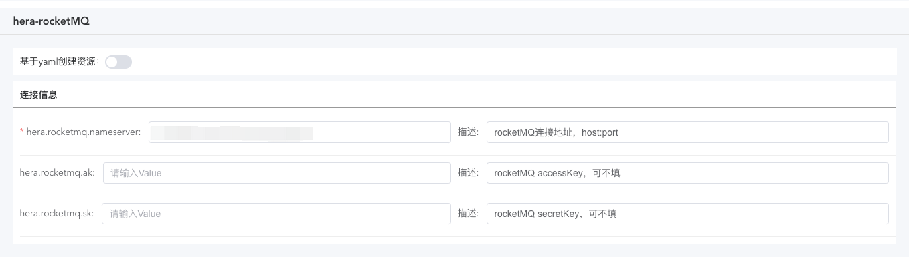

#### Hera-Nacos

hera集群内部的配置、注册中⼼，该集群建议⾛yaml创建⽅式，如果业务需要⾃⾏提供Nacos，请优先提供1.x版本的Nacos。

Nacos集群

如果需要k8s⾃动搭建⼀个Nacos

则需要开启“基于yaml创建资源”按钮，注意yaml中的镜像地址、资源⼤⼩配置及右侧连接信息   与yaml中保持⼀致

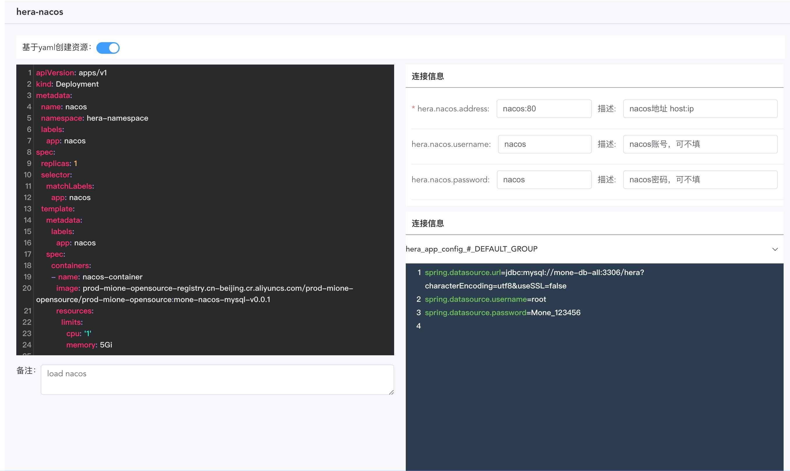

如果已有Nacos，⽆需k8s创建

则需关闭“基于yaml创建资源”按钮，填写正确的nacos连接信息

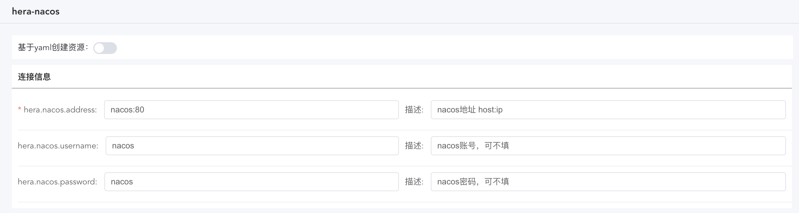

Nacos配置

operator会默认将这⾥所列的配置初始化为nacos配置，如果提供的不是基于yaml所创建的nacos，请确认连接信息有权限调⽤config创建接⼝，否则需要提前去⽬标nacos中⼿动创建好。

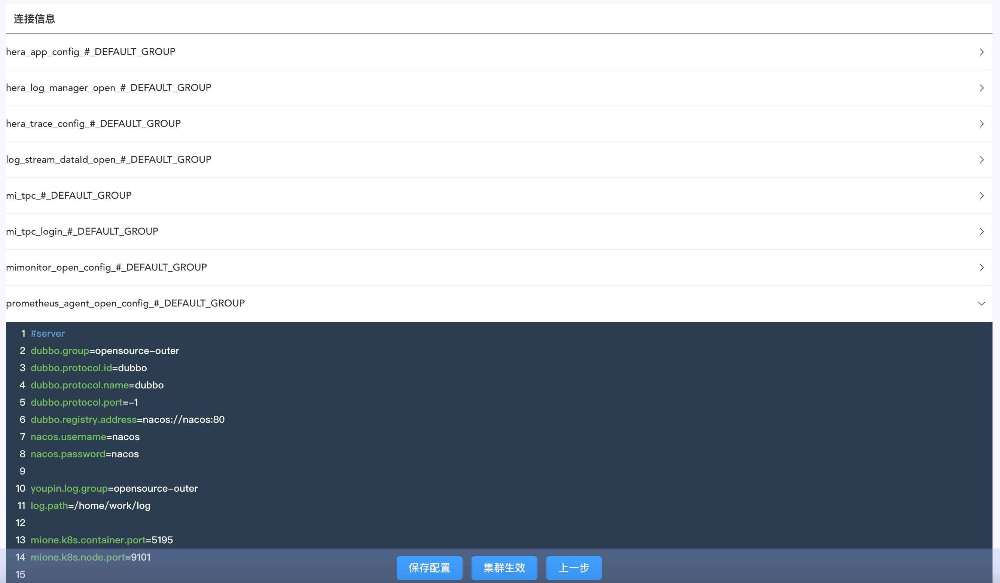

#### hera-tpc-login-fe

hera-tpc-login-fe是负责构建tpclogin登录前端⻚⾯的yaml 需要注意的是：

1.  需要根据访问量来修改pod副本数(replicas)与pod资源限制(resources)

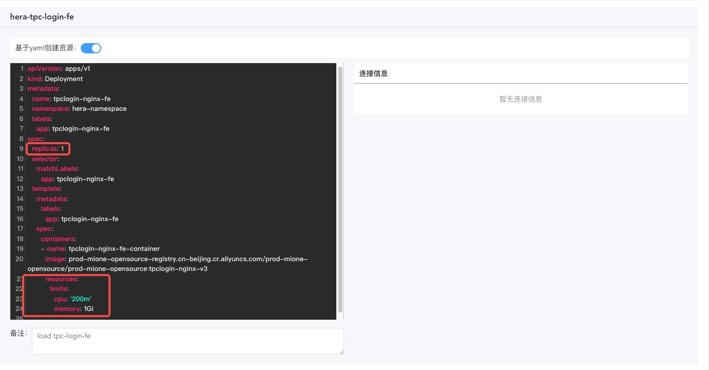

#### Hera-Grafana

⽬的是选择⼀个hera可⽤的grafana 如果沿⽤默认的yaml，⼀定要注意：

1.  提前在宿主机node上创建⽬录/home/work/grafana\_hera\_namespace\_pv;
2.  找到创建⽬录的node名（可以执⾏ kubectl get node进⾏确认），替换此处的cn- beijingxxx；


#### Hera-Prometheus

⽬的是选择⼀个hera可⽤的prometheus 如果沿⽤默认的yaml，⼀定要注意：

1.  提前在宿主机node上创建⽬录/home/work/prometheus\_hera\_namespace\_pv;
2.  找到创建⽬录的node名（可以执⾏ kubectl get node进⾏确认），替换此处的cn- xxx

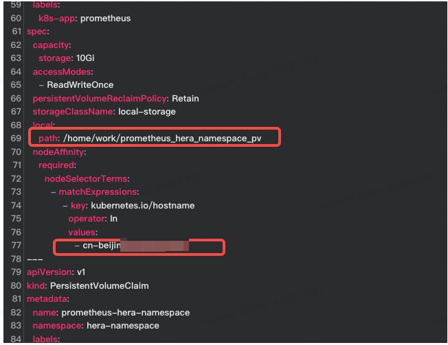

#### hera-fe

hera-fe是负责构建hera前端⻚⾯的yaml 需要注意的是：

1.  需要根据访问量来修改pod副本数(replicas)与pod资源限制(resources)

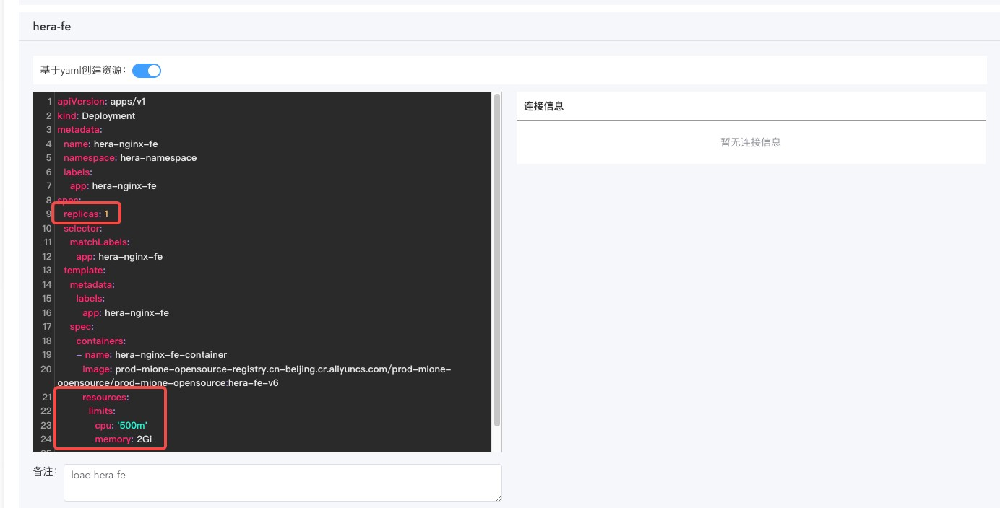

#### Hera-Alertmanager

⽬的是选择⼀个hera可⽤的alertmanager 如果沿⽤默认的yaml，⼀定要注意：

1.  提前在宿主机node上创建⽬录/home/work/alertmanager\_hera\_namespace\_pv;
2.  找到创建⽬录的node名（可以执⾏ kubectl get node进⾏确认），替换此处的cn- xxx；

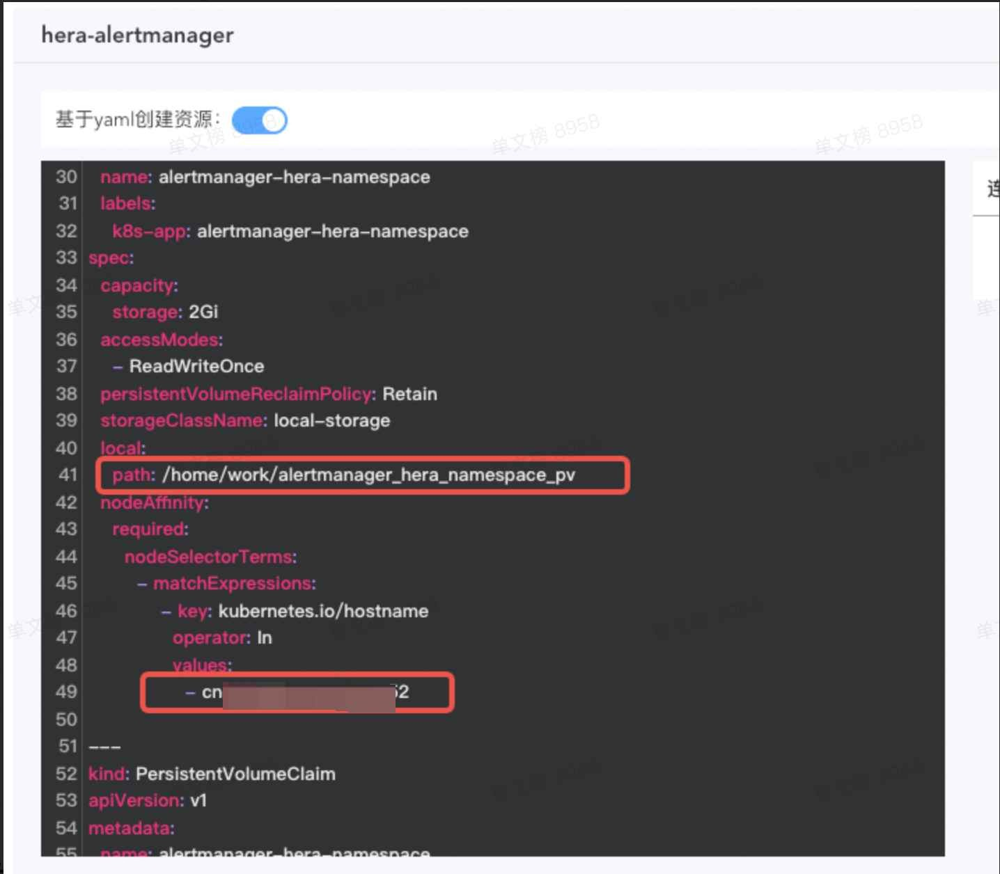

#### hera-tpc-login

hera-tpc-login是负责构建tpclogin登陆服务后端的yaml 需要注意的是：

1.  需要根据访问量来修改pod副本数(replicas)与pod资源限制(resources)&#x20;
2.  服务启动的配置像个信息在上⽅的nacos配置中

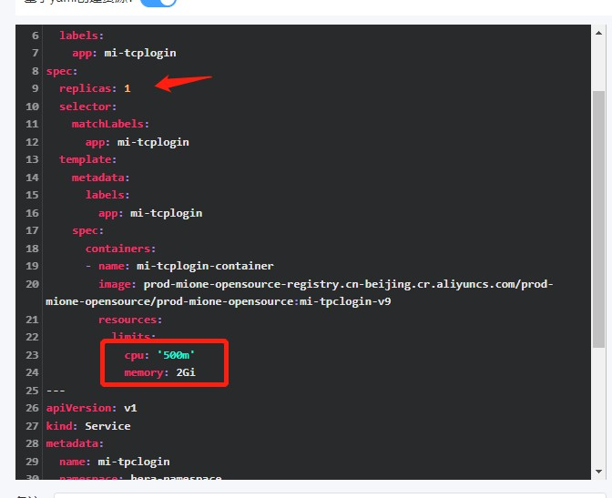

#### Hera-trace-etl-es

需要注意的是：

1.  该服务是StatefulSet类型服务
2.  提前在宿主机node上创建⽬录/home/work/rocksdb（可更换⽬录，同步修改此处yaml）&#x20;
3.  找到创建⽬录的node名（可以执⾏ kubectl get node进⾏确认），替换此处的nodeSelectorTerms下的values的值
4.  需要根据trace流量来修改pod副本数(replicas)与pod资源限制(resources)&#x20;
5.  服务的pod副本数尽量与RocketMQ的queue size保持⼀致

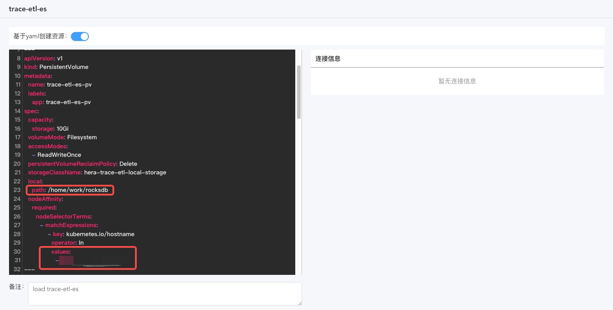

#### hera-cadvisor

TODO

#### hera-node-exporter

TODO

#### Hera-app

hera-app是负责负责hera系统中应⽤app相关逻辑操作，可以通过这个服务向外提供对应⽤的各种服  务信息

需要注意的是：

1.  需要根据访问量来修改pod副本数(replicas)与pod资源限制(resources)

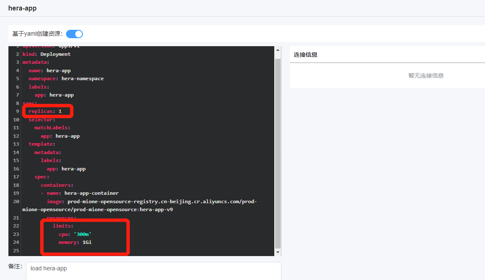

#### Hera-log-manager

hera-log-manager主要负责⻚⾯应⽤⽇志的接⼊，以及各种元数据的配置下发

需要注意的是：

1.  由于该服务需要对外提供http服务，因此需要开⼀个端⼝，端⼝默认来⾃与项⽬中的配置⽂     件，默认为7788

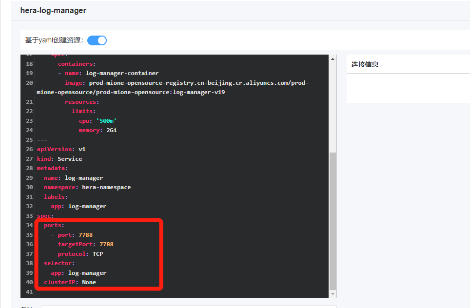

#### hera-log-agent-server

TODO 

#### hera-log-stream

hera-log-stream负责消费mq中的应⽤⽇志信息，然后负责应⽤⽇志解析，最后存⼊存储空间(ES) 需要注意的是：

1.  该服务是StatefulSet类型服务
2.  需要注⼊⼀个环境变量MONE\_CONTAINER\_S\_POD\_NAME，值为容器pod的名称

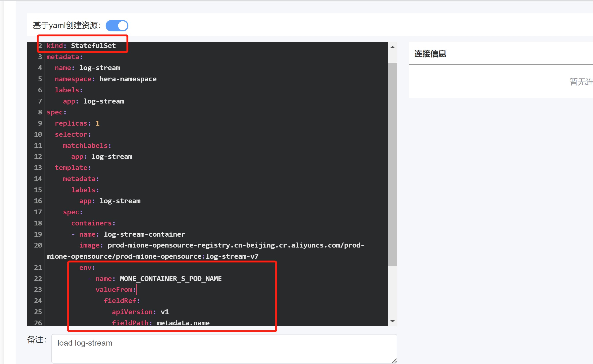

#### hera-mimonitor

mimonitor是hera监控⾸⻚应⽤中⼼、指标监控、报警配置的后端服务，建议直接使⽤operator  提供的基于yaml创建资源的⽅式部署。当然，也可以⾃⾏部署mimonitor服务（关闭给予yaml资源 创建的开关），⾃⼰部署服务，需要调整前端对接的相应参数：如ip地址、端⼝号等。

注意点：在部署之前，先初始化数据库及对应的中间件资源。

1.  mysql在nacos配置mysql的数据库，在对应的数据库名下按照[hera-all](https://github.com/XiaoMi/mone/tree/master/hera-all "hera-all")/mimonitor/sql ⽂件初始化数据库表。
2.  rocketMq按照nacos上的配置，在对应的rocket服务器上创建mq相应的topic和tag。
3.  es按照nacos上的配置，在对应的es服务器上创建es相应的索引。
4.  使⽤operator⾃动创建资源，可以根据⾃⼰的实际流量情况调整副本数，replicas。实例中是⼀个副本；同样，可是根据需要在operator的yaml⽂件中调整k8s相关的资源，如 cpu、memory。

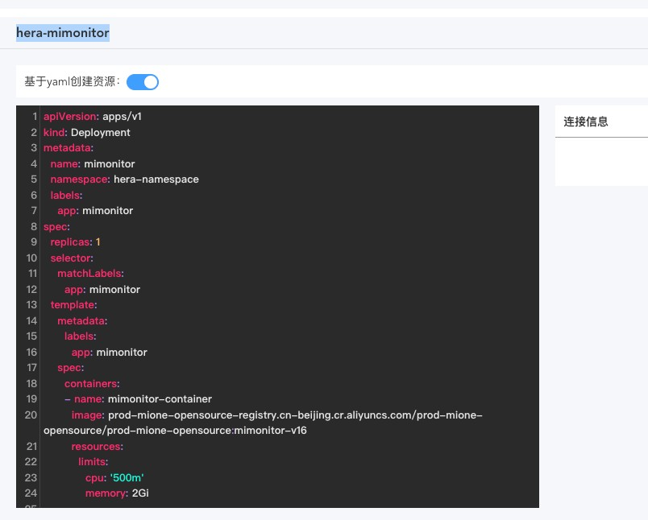

#### hera-tpc

hera-tpc是负责构建tpc服务后端的yaml 需要注意的是：

1.  需要根据访问量来修改pod副本数(replicas)与pod资源限制(resources) 2、服务相关配置在上⽅的nacos配置中配

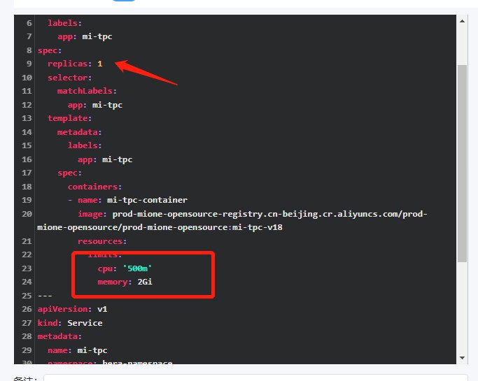

#### hera-tpc-fe

hera-tpc-fe是负责构建tpc前端⻚⾯的yaml 需要注意的是：

1.  需要根据访问量来修改pod副本数(replicas)与pod资源限制(resources)

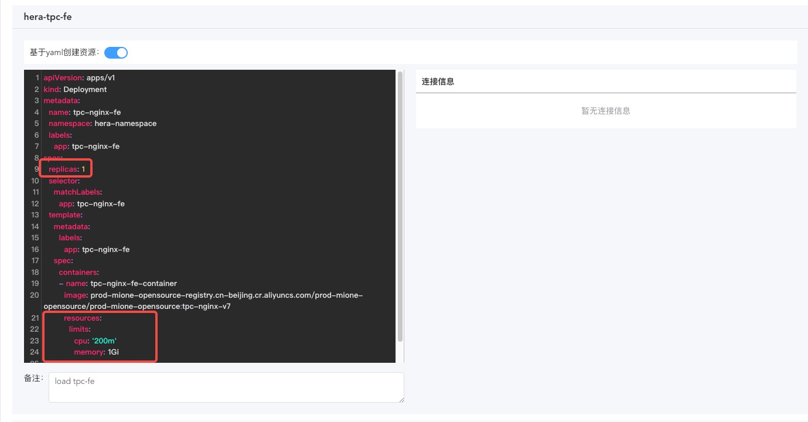

#### hera-trace_etl_manager

需要注意的是：

1.  需要根据访问量来修改pod副本数(replicas)与pod资源限制(resources)

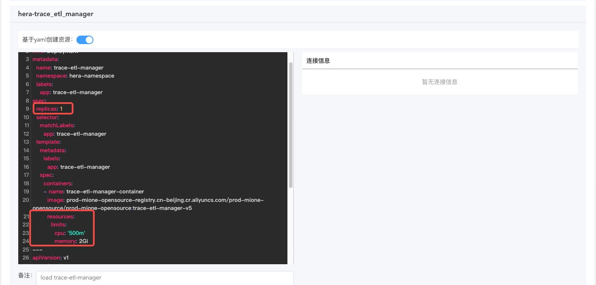

#### hera-trace-etl-server

需要注意的是：

1.  需要根据访问量来修改pod副本数(replicas)与pod资源限制(resources) 2、服务的pod副本数需要与RocketMQ的queue size保持⼀致

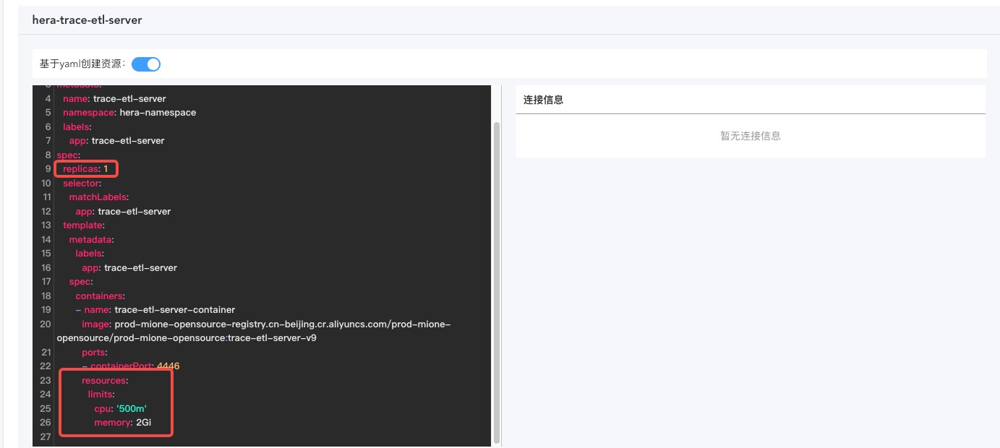

### 2.5.5集群部署

保存配置

确保2.4.4步骤完毕后，点击保存配置，该步骤会完成:

1.  整个配置的保持；
2.  nacos变量替换（nacos配置中有\${变量}配置的，会⾃动完成⼀轮替换，替换值来源于输⼊的连接信息、第⼆步⽣成的访问⽅式ip:port）

集群⽣效

确保"保存配置"已完成后，可点击"集群⽣效"进⾏整个hera集群的部署。

## 2.6清空集群资源

有的时候operator执⾏过程中如果产⽣报错，需要我们重置⽬前K8s namespace的资源，重新通过operator⽣成。清空接⼝需要⾸先获取operator⻚⾯的ip：port。http\://\${operator⻚⾯的ip:port}/hera/operator/cr/delete

## 2.7问题排查

建议在执⾏“集群⽣效”之后，同时也kubectl logs -f hera-operator的容器⽇志，如果看到ERROR相关的⽇志可以反馈给对接⼈员。

## 2.8确认Hera各组件初始化情况

### 2.8.1确认pod启动状态

可以使⽤kubectl get pods -n hera-namespace，查看各pod是否是running，是否有⼤量restart的pod，

### 2.8.2确认初始化是否正常

#### ES

为了节省资源，operator没有⾃带kibana，可以通过安装kibana查看ES集群中是否有Hera创建的索引模版。

Kibana yaml

env中的ELASTICSEARCH\_HOSTS需要更换为ES的集群api地址

```yaml
apiVersion: apps/v1
kind: Deployment
  metadata:
  name: kibana
  namespace: hera-namespace
  labels:
    app: kibana
spec:
  replicas: 1
  selector:
    matchLabels:
      app: kibana
  template:
    metadata:
      labels:
        app: kibana
    spec:
      containers:
      - name: kibana
        image: docker.elastic.co/kibana/kibana:7.6.2
        resources:
          limits:
            cpu: 500m
          requests:
            cpu: 500m
      env:
        - name: ELASTICSEARCH_HOSTS
          value: http://elasticsearch:9200
      ports:
      - containerPort: 5601
```

安装成功后，进⼊kibana⻚⾯，查看是否有如下的索引模版：

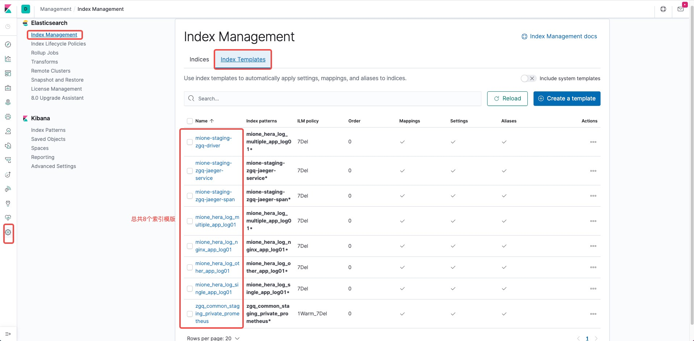

#### RocketMQ

可以通过rocketmq-dashboard查看是否有以下topic：

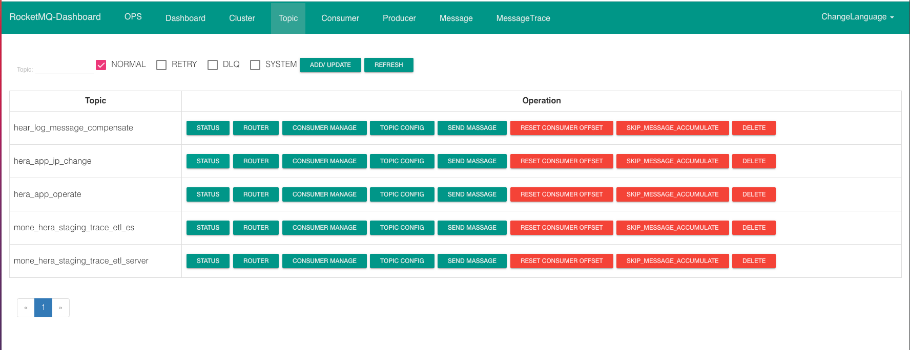
